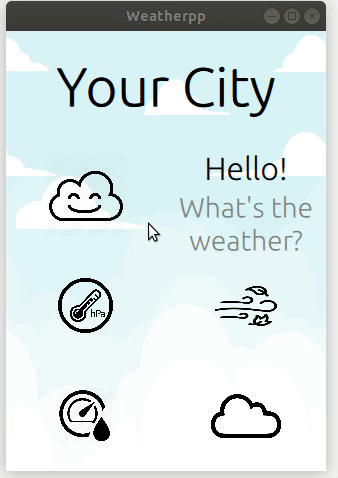

# Weather App



Table of contents: <br>
* **[About](#about)**
* **[Building the project](#building-the-project)**
* **[Credentials](#credentials)**

## About

Project shows current weather in given city. Under the hood it uses operweathermap api to get data. Registration is required in order to using the application.

## Building the project

The project can be built with use of QtCreator or [from command line](#command-line-build). Before building the projects there is need to update credentials file, [details](#credentials). If you built project before putting new credentials, remember to compile it again.

## Credentials

In order to make the app working, there is need to register at openweathermap.org.
The api key should be put into Credentials/credentials. 

## Command Line Build

```sh
mkdir build
cd build
qmake ..
make -j8
```